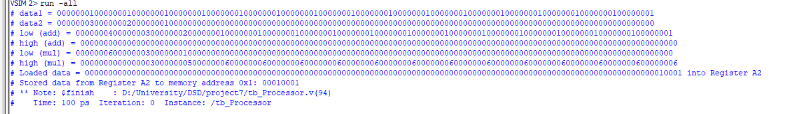

## سوال ۷

در این بخش به حل سوال ۷ پرداخته شده است . پروژه ی مدنظر ساخت یک پردازنده آرایه ای 512 بیتی می باشد که دارای 3 بخش است : یک رجیستر فایل با قابلیت ذخیره سازی 4 آرایه 512 بیتی ، یک واحد ریاضی با قابلیت ضرب و جمع ، یک حافظه با عمق 512 و عرض 32 بیت است . مجموعه دستورات این پردازنده شامل بارگزاری از حافظه در یکی از ثبات ها ، ذخیره سازی از یکی ثبات ها به حافظه ، جمع واحد ریاضی و ضرب واحد ریاضی می باشد که در ادامه به بررسی دقیق تر آن پرداخته شده است . 

## ابزار های استفاده شده در پروژه

- ModelSim

## جزئیات پیاده سازی
**ماژول RegisterFile**

همانگونه که درتصویر بالا مشاهده می‌کنید ماژول ۶ ورودی دارد که ۲ ورودی برای انتخاب آدرس‌های خوانده‌شونده ، یک ورودی برای کلاک ، یک ورودی برای write enable و یک ورودی برای دریافت دیتایی که می‌خواهیم در آدرس مدنظر بنویسیم . همانگونه که در خط 12 مشاهده می‌شود 4 عدد آرایه 512 بیتی خواسته ی سوال را تعریف کرده ایم . حال به بررسی بلاک always میپردازیم که بخش ابتدایی آن به نوشتن در رجیسترفایل پرداخته شده‌‌ است (در صورتی که write_en ، یک باشد یعنی قصد نوشتن را داریم که بعد از آن وارد بلاک switch case می‌شود که بسته به آدرس داده‌شده ، دیتا را دررجیستر مربوطه ذخیره می‌کند .) . در بخش بعد به خواندن از رجیستر فایل پرداخته‌شده‌است (دو ورودی rd_data1 و rd_data2 بررسی می‌شوند که این دو ورودی همانگونه که ذکر‌شد دارای آدرس‌هایی هستند که میخواهیم از رجیستر فایل بخوانیم و بسته به این آدرس‌های رجیسترها دیتاهای مدنظر وارد خروجی می‌شوند.) .

**ماژول MathUnit**

همانگونه که در تصویر بالا مشاهده می‌کنید ماژول ۴ ورودی دارد که ۲ ورودی اول برای محاسبات هستند و یک ورودی add برای تشخیص جمع کردن و یک ورودی mul برای تشخیص ضرب دارد . در بلاک always اگر add ، یک باشد عمل جمع را انجام داده و در low می ریزد و high را صفر می کند و اگر mul ، یک باشد عمل ضرب را انجام داده و باتوجه به سینتکس استفاده شده 512 بیت کم ارزش را در low و 512 بیت پرارزش را در high ریخته و خروجی می دهد و در غیر این صورت اگر هیچکدام از حالت های گفته شده نبود خروجی های ماژول را صفر می کند . 

**ماژول Memory**

همانگونه که در تصویر بالا مشاهده می کنید ماژول ۴ ورودی دارد که یک ورودی کلاک ، یک ورودی write enable ، یک ورودی آدرس و یک ورودی دیتا می باشد . در خط 8 Memory با عمق 512 و عرض 32 بیت مطابق خواسته ی سوال تعریف شده است . در بلاک always همانگونه که مشاهده می شود اگر write_enable ، یک باشد یعنی عمل نوشتن در حافظه صورت بگیرد ( دیتایی که به عنوان ورودی به ماژول دادیم را در آدرس خواسته شده در حافظه ذخیره می کند ) و در غیر این صورت اگر write_enable صفر باشد ، آدرس داده شده از حافظه را خوانده و وارد خروجی می کند . 

**ماژول processor**

همانگونه که در تصویر مشاهده میکنید در این ماژول از سه ماژول دیگر که تعریف شده است instance گرفته و پورت های مربوطه را وصل کرده ایم . نکته ی قابل ذکر این است که برای دستورات بارگزاری از حافظه در یکی از ثبات ها و ذخیره سازی از یکی از ثبات ها به حافظه به عبارتی دستورات load و store از دو TriState-Buffer استفاده کرده تا دستورات به درستی اجرا شوند . 

**ماژول tb_processor**

همانگونه که مشاهده می شود از ماژول processor نمونه گرفته و پورت های مربوطه را تعریف کرده ایم . در بلاک always پورت مربوط به کلاک را تاگل کرده و در بلاک initial ، از خط 41 تا 50 ، دو عدد دیتا را در رجیستر های A1 و A3 رجیسترفایل نوشته و در خط 50 تا 53 آنها را خوانده و در خط 58 و 59 مقادیر رجیسترها را چاپ میکنیم . همانگونه در که در خط 55 مشاهده میکنید ابتدا دستورا جمع را اجرا کرده و چاپ میکنیم و سپس دستور ضرب اجرا و چاپ می شود . برای بررسی دستور لود یا بارگزاری از حافظه در یکی از رجیستر ها ، مقداری را در حافظه نوشته و سپس آن را به رجیستر فایل متنقل کرده و برای بررسی صحت این بارگزاری آن را در خروجی پرینت می کنیم . برای بررسی دستور ذخیره سازی از یکی از ثبات ها به حافظه مقدار دیتا مدنظر را جا به جا کرده و آن را از خروجی حافظه می خوانیم .

## نحوه‌ی اجرا

ابتدا همه ی ماژول ها را compile کرده و پس از simulate کردن ماژول tb_processor وارد صفحه ی جدیدی شده و run-all را زده ، خروجی زیر را مشاهده می کنید :

اگر از ابتدا به بررسی خروجی بپردازیم ، همانگونه که مشاهده می کنید دو دیتای ذخیره شده به درستی نمایش داده شده اند و خروجی جمع نیز همانگونه که انتظار می رفت به درستی نمایش داده شده است . برای خروجی ضرب نیز ضرب دو عدد ذخیره شده در رجیستر فایل همانگونه که نمایش داده شده به درستی خروجی های low و high را مشاهده می کنید . برای بررسی دستور load اگر ماژول تست را دوباره مشاهده کنید می بینید همان دیتایی که در حافظه ذخیره کردیم به درستی وارد رجیستر فایل شده و خروجی که از رجیستر فایل گرفتیم نیز با آن یکسان می باشد .  درنهایت برای بررسی دستور store همانگونه که انتظار می رفت دیتا به درستی وارد حافظه شده و یکسان به خروجی حافظه می باشد ، در نتیجه به صحت کارکرد پردازنده ی آرایه ای که ساخته شده می رسیم . 

## نویسنده
مبینا رشیدی 401170564
